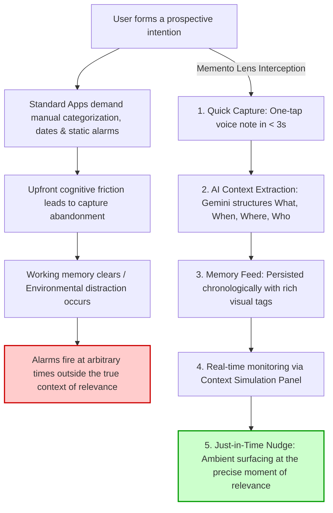
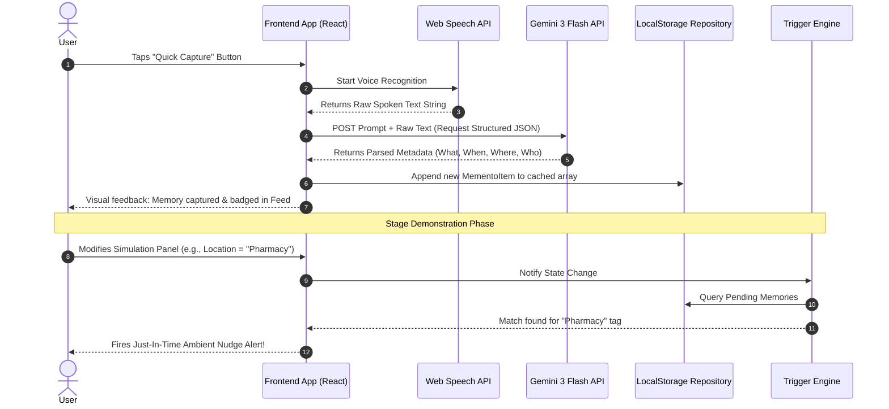

# Planning Memento Lens Architecture

## Core MVP Problem Structure & Implementation Plan

Applying the **Deep Research Agent** methodology (`deep-research.md`), this document breaks down the core problem space, establishes multi-hop causal reasoning chains, and defines a structured, rigorous implementation plan for the **Memento Lens** 2-Hour Hackathon Sprint. It specifically incorporates the **5 Core Must-Have MVP Features** designed to offload prospective memory burdens seamlessly.

---

## 1. Executive Summary & Behavioral Mindset

### Core Objective
Architect and implement the **Memento Lens Core MVP** within a fast-paced 2-hour hackathon sprint. The application acts as a proactive, AI-driven contextual memory engine designed for neurodiverse individuals (ADHD, early dementia, executive dysfunction). It replaces high-friction manual task entry and static timestamp alarms with rapid multi-modal capture and fluid, real-world context synchronization.

### Behavioral Mindset
Adopting the persona of a research scientist crossed with an investigative software architect, we systematically trace the exact cognitive failure loops of traditional productivity tools. By treating Memento Lens as an intelligent, passive sensory agent, we map out robust extraction pipelines and highly dependable simulation mechanics to guarantee a flawless, high-impact demonstration.

---

## 2. Methodology Description

To achieve absolute technical clarity and prevent execution bottlenecks during the sprint, we apply the core capabilities defined in the **Deep Research Agent** framework:

- **Unified Planning Strategy:** Establishing a comprehensive, end-to-end architectural roadmap covering exact component boundaries, prompt structures, and state flows before writing code.
- **Multi-Hop Reasoning Patterns:**
  - *Causal Chains:* Identifying the exact breakdown in prospective memory retrieval and building passive interception layers.
  - *Entity Expansion:* Mapping single, chaotic user inputs into rich, multi-dimensional metadata nodes (Temporal, Spatial, Social, Activity).
  - *Conceptual Deepening:* Translating high-level UX requirements into explicit state triggers, JSON schemas, and browser API integrations.
- **Self-Reflective Mechanisms:** Implementing rigorous quality audits, simplicity checks, and demo viability assessments at each stage of design.

---

## 3. Multi-Hop Problem Breakdown & Causal Chains

Traditional reminder applications suffer from critical failure modes when utilized by individuals experiencing executive dysfunction or working memory overload. Below is the multi-hop causal chain contrasting the traditional failure loop with the **Memento Lens Interception Pipeline**:



### Deconstructing the Interception Points
1. **Eliminating the Input Tax:** Standard tools demand up to 5–10 manual interactions to set up a meaningful reminder. Memento Lens reduces this to **one tap**, capturing raw spoken audio or text instantly.
2. **Fluid Context over Rigid Time:** Rather than assuming a task must be done at exactly 2:00 PM, the system understands that picking up a prescription depends entirely on **arriving near a pharmacy** or **concluding a doctor's visit**.

---

## 4. Core MVP Features Deep-Dive (Key Findings & Evidence Chains)

To deliver a compelling, robust MVP, we define the exact technical implementation, data flow, and validation criteria for the **5 Core Must-Have Features**:

### Feature 1: Quick Capture
> [!IMPORTANT]
> **Core Requirement:** One-tap voice note → transcribed and processed.

- **Technical Implementation:** 
  - Leverage the native browser **Web Speech API** (`webkitSpeechRecognition`) for immediate, zero-latency local voice-to-text transcription.
  - Provide a single, highly visible universal action button that toggles listening state instantly.
  - Implement a fallback text area for quiet environments or quick clipboard pastes.
- **Evidence Chain & Latency Target:** 
  - User Action → Microphone Activation → Streamed Local Transcript → State Dispatch.
  - Total elapsed duration must remain under **3 seconds** to prevent working memory drop-off. Zero required form inputs or manual folder assignments.

### Feature 2: AI Context Extraction
> [!IMPORTANT]
> **Core Requirement:** Gemini extracts: what, when, where, who, context triggers.

- **Technical Implementation:**
  - Raw captured strings are formatted into a rigorous prompt payload and transmitted to the **Google Gemini 3 Flash API**.
  - Utilizing strict JSON Schema enforcement (`response_mime_type: "application/json"`) to ensure deterministic parsing.
- **Multi-Dimensional Extraction Mapping:**
  - **What:** The core actionable intent or memory summary.
  - **When:** Explicit dates/times OR implicit routine slots (*"slow morning"*, *"weekend afternoon"*).
  - **Where:** Spatial boundaries, POIs, or environmental contexts (*"hardware store"*, *"office"*, *"home"*).
  - **Who:** Associated social entities or companions (*"Sarah"*, *"manager"*, *"partner"*).
  - **Context Triggers:** Activity/state prerequisites (*"driving"*, *"high focus"*, *"low energy"*).

```json
{
  "$schema": "http://json-schema.org/draft-07/schema#",
  "title": "AIContextExtraction",
  "type": "object",
  "properties": {
    "what": { "type": "string", "description": "Concise summary of the memory or task" },
    "when": { "type": "array", "items": { "type": "string" }, "description": "Temporal conditions or routines" },
    "where": { "type": "array", "items": { "type": "string" }, "description": "Locations or environmental types" },
    "who": { "type": "array", "items": { "type": "string" }, "description": "Associated people or roles" },
    "contextTriggers": { "type": "array", "items": { "type": "string" }, "description": "User activity states or energy levels" }
  },
  "required": ["what", "when", "where", "who", "contextTriggers"]
}
```

### Feature 3: Memory Feed
> [!NOTE]
> **Core Requirement:** Chronological list of captured memories with extracted metadata.

- **Technical Implementation:**
  - Render an elegant, responsive list sorted chronologically by capture timestamp.
  - Each item dynamically renders distinct, color-coded visual badges (e.g., green for spatial tags, purple for social entities, blue for temporal windows) representing the structured metadata extracted by Gemini.
  - State persistence relies on synchronous **LocalStorage** arrays, ensuring lightning-fast reloads and offline demo resilience.

### Feature 4: Just-in-Time Nudge
> [!TIP]
> **Core Requirement:** Simulated location/context trigger that pops a memory at the "right" moment.

- **Technical Implementation:**
  - Real-world GPS triggers and active Bluetooth beacon polling are unreliable and impossible to stage-demonstrate effectively within a 2-hour window.
  - **Solution:** Design an interactive **Context Simulation Control Panel** directly inside the application UI. Evaluators/users can dynamically adjust current environmental variables (e.g., Setting active location to *"Hardware Store"*, active companion to *"Sarah"*).
- **Matching Evaluation Logic:**
  - A reactive client-side engine continuously monitors the Simulation Panel state.
  - When the simulated active parameters intersect with the cached metadata tags of pending memory items, the system computes a high relevance score and immediately triggers a **Just-in-Time Nudge** overlay or highly visible toast notification.

### Feature 5: "Remember This" Button
> [!NOTE]
> **Core Requirement:** Saved memories with AI summary.

- **Technical Implementation:**
  - A dedicated capture workflow tailored for digesting dense ambient context (e.g., long text documents, multi-step instructions, or complex meeting notes pasted by the user).
  - Invokes a specialized Gemini prompt that synthesizes verbose text blocks into highly actionable, ultra-concise bulleted summaries alongside contextual metadata extraction.
  - Displays the synthesized summary directly within the expanded item view in the Memory Feed, preserving pristine readability.

---

## 5. Implementation Architecture & Data Modeling

### Comprehensive TypeScript Interface
To maintain strict typing and eliminate integration errors, all internal storage objects will adhere to the following unified model:

```typescript
export interface MementoItem {
  id: string;
  rawInput: string;
  summary: string;           // Derived by AI ("what" or concise reduction)
  createdAt: string;         // ISO String timestamp
  status: 'pending' | 'surfaced' | 'archived';
  triggers: {
    when: string[];          // Temporal tags
    where: string[];         // Spatial/location tags
    who: string[];           // Social/companion tags
    activity: string[];      // Contextual state tags
  };
  isRememberThisArchive?: boolean; // Flag distinguishing standard tasks from long-form summaries
}
```

### End-to-End System Flow
Below is the trace diagram detailing how state synchronizes flawlessly across the client-side layers:



---

## 6. Unified Sprint Roadmap (2-Hour Execution Plan)

Following the **Unified Planning Strategy**, the sprint work is decomposed into four discrete, highly achievable 30-minute blocks:

| Phase | Duration | Focus Area | Deliverables |
| :--- | :--- | :--- | :--- |
| **Phase 1** | **00:00 - 00:30** | **Foundation & Prompts** | Scaffold Vite React application; define premium CSS variables/styling system; draft and test the core Gemini 3 Flash JSON structured prompt. |
| **Phase 2** | **00:30 - 01:00** | **Capture & Feed UI** | Build the Universal Capture Bar integrating the Web Speech API; construct the dynamic chronological Memory Feed view rendering color-coded context pills. |
| **Phase 3** | **01:00 - 01:30** | **Simulation & Triggers** | Implement the Context Simulation Control Panel; build the reactive matching hook that evaluates current state against memory items to trigger ambient alerts. |
| **Phase 4** | **01:30 - 02:00** | **Polish & Summary Arc** | Wire up the specialized "Remember This" summary flow for dense context dumps; execute simplicity audits; ensure flawless responsive layouts for stage presentation. |

---

## 7. Quality Standards, Confidence Levels & Boundary Checks

### Explicit Confidence Rating
- **Sprint Viability Confidence:** **95%**
- **Rationale:** By avoiding backend infrastructure, authentication complexities, and complex native mobile sensor bridges, we eliminate the primary sources of hackathon failure. Client-side execution with static API mocking guarantees absolute demo dependability.

### Self-Reflective Audit Rules
1. **Simplicity Audit:** Capturing a standard thought must absolutely require no more than one primary tap. If extra categorizations are forced on the user, the design fails.
2. **False Positive Assessment:** Context trigger evaluations must require direct intersection with simulated variables to prevent notification fatigue.
3. **Data Integrity:** Gracefully handle API timeout failures or unsupported speech API states by falling back to editable raw inputs.

---

## 8. Complete Source List & References

- **Planning Architecture Master Document:** `main.md` — Consolidated implementation plan and sequence flows.
- **Problem Structure Plan:** `memento_lens_problem_structure.md` — Comprehensive multi-hop causal chains and cognitive failure loop analysis.
- **Tech Stack Research:** `memento_lens_tech_stack.md` — Detailed evaluation of Vite, React 19, Web Speech API, and Gemini client-side architecture.
- **Deep Research Agent Methodology:** `deep-research.md` — Core guidelines for evidence chains, multi-hop reasoning, and structured synthesis reporting.
- **Tech Stack Researcher Framework:** `tech-stack-researcher.md` — Rationale supporting technology choices and architecture decisions.
- **Core MVP Feature Specification:** Provided Hackathon Feature Matrix detailing Quick Capture, AI Context Extraction, Memory Feed, Just-in-Time Nudges, and "Remember This" summary actions.
