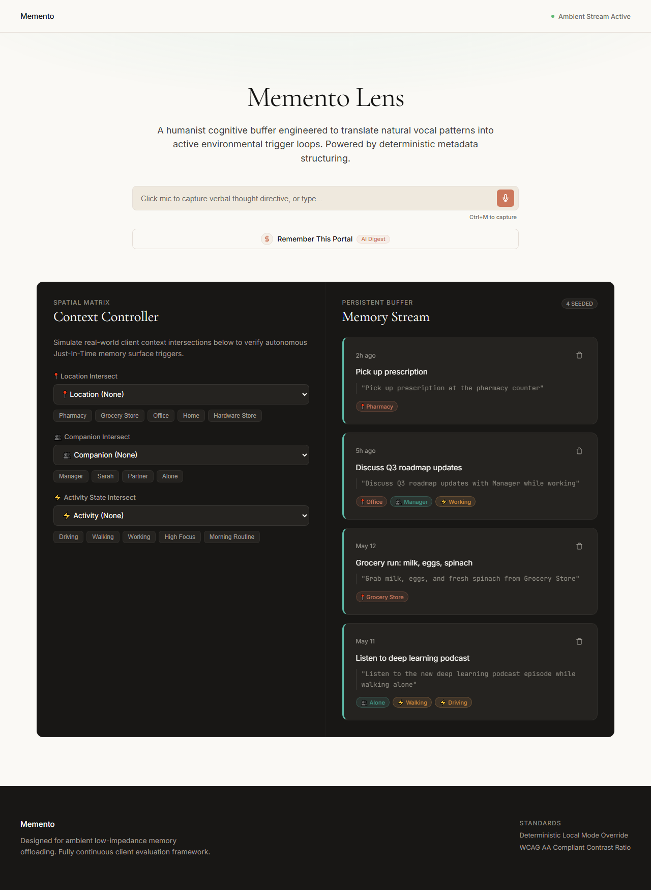
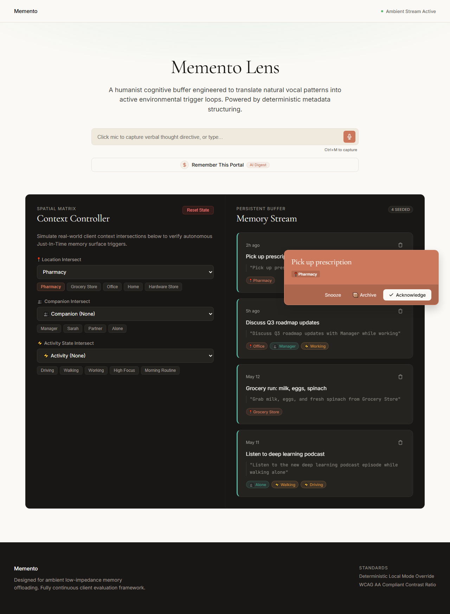
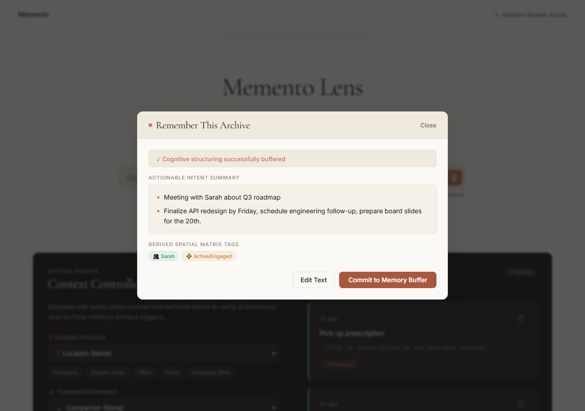

# Memento Lens — Proactive Ambient Memory Engine

 **Live Demo:** (https://memento-lens.vercel.app) 

**Memento Lens** is a highly specialized, proactive AI-driven contextual memory offloading application designed for neurodiverse individuals (ADHD, early dementia, executive dysfunction). It directly intercepts prospective memory breakdown loops by replacing manual form-entry folders and static time alarms with rapid multi-modal capture and real-world environmental context synchronization.

---

## 🌟 Core MVP Features

1. **Quick Capture:** Instant one-tap voice note integration via the native browser **Web Speech API** capturing intentions locally in under 3 seconds.
2. **AI Context Extraction:** Utilizes **Google Gemini 3 Flash** with structured JSON Schema enforcement to automatically derive multidimensional entity nodes: **What**, **When**, **Where**, **Who**, and **Activity Dependencies**.
3. **Memory Stream:** Persistent chronological feed displaying elegant glassmorphism styling and contextual badges corresponding to extracted multi-dimensional tags.
4. **Interactive Context Simulation:** Embedded demo evaluation engine simulating real-world parameters (Location, Companion, Activity State) to dynamically test intersection logic.
5. **Just-in-Time Ambient Nudges:** Proactively surfaces high-relevance intent overlays exactly when simulated state intersects with pending task prerequisites.
6. **"Remember This" Long-form AI Digest:** Dedicated portal optimized for parsing verbose notes, multi-step instructions, or complex project contexts into ultra-concise bulleted actionable insights.

---

## 📸 Demo

### Memory Feed & Context Extraction

*Chronological memory feed with AI-extracted context badges — temporal, spatial, social, and activity tags derived automatically from voice or text input.*

### Just-in-Time Ambient Nudge

*When simulated context (Location: "Pharmacy") intersects with stored memory triggers, the nudge fires proactively — no alarms, no manual checking required.*

### AI-Powered Summarization

*The "Remember This" portal reduces dense meeting notes or multi-step instructions into concise actionable bullet points with extracted context tags.*

---

## 🚀 Environment Setup & Local Deployment

### Prerequisites
- **Node.js** v18+ 
- **Vite** compatibility

### Installation

1. Clone the repository and install dependencies:
   ```bash
   npm install
   ```

2. **CRITICAL CONFIGURATION:** Configure your API Key environment variables. Create a `.env` file in the root directory:
   ```env
   VITE_GEMINI_API_KEY="your_actual_google_gemini_api_key_here"
   ```
   > **Note on Zero-Config Resilience:** If `VITE_GEMINI_API_KEY` is omitted or left as a placeholder, Memento Lens automatically falls back to a highly robust client-side simulation parsing engine to guarantee unhindered demonstration access out of the box!

3. Run the live development server:
   ```bash
   npm run dev
   ```

4. Build production static bundle:
   ```bash
   npm run build
   ```

---

## 🏛️ System Architecture

```
src/
├── components/
│   ├── UniversalCaptureBar.tsx   # Voice & text quick capture interface
│   ├── RememberThisButton.tsx    # Contrasting portal entry component
│   ├── RememberThisModal.tsx     # Large block input reduction framework
│   ├── MemoryFeed.tsx            # Live state badge projection interface
│   ├── ContextSimPanel.tsx       # Live variable evaluator panel
│   └── JustInTimeNudge.tsx       # Proactive overlay notification trigger
├── context/
│   └── SimulationContext.tsx     # Top level React Context global state provider
├── hooks/
│   └── useSpeechRecognition.ts   # Declarative WebkitSpeech API lifecycle wrap
├── utils/
│   ├── storage.ts                # Try/catch wrapped localStorage array broker
│   └── gemini.ts                 # GoogleGenerativeAI client & fallback generator
├── App.tsx                       # Main flow orchestration & trigger intersect loop
├── main.tsx                      # DOM client insertion point
└── index.css                     # Vibrant design tokens, dark mode & animation frames
```

---

## 🛡️ Presentation & Demo Audit Guidelines

- **Input Minimalist Rules:** Every thought input requires zero form assignments. One tap to talk/type.
- **Offline Stage Ready:** LocalStorage seed payloads provide pre-populated context tags directly suited for real-time evaluator adjustments.
